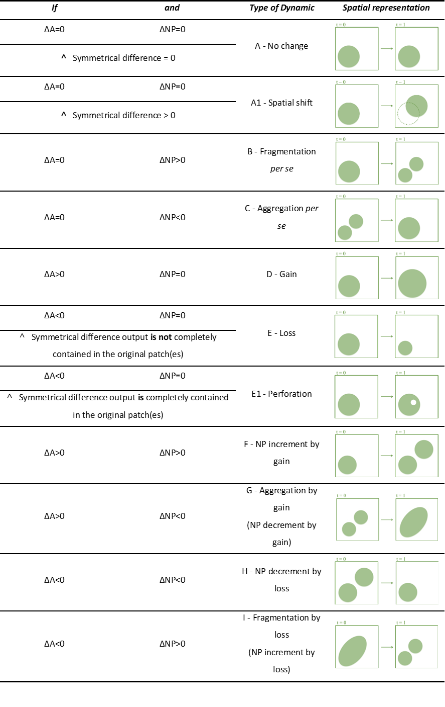
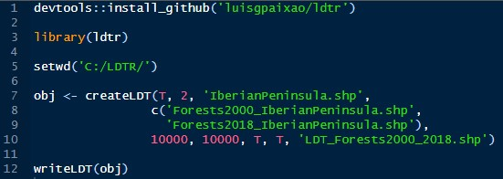
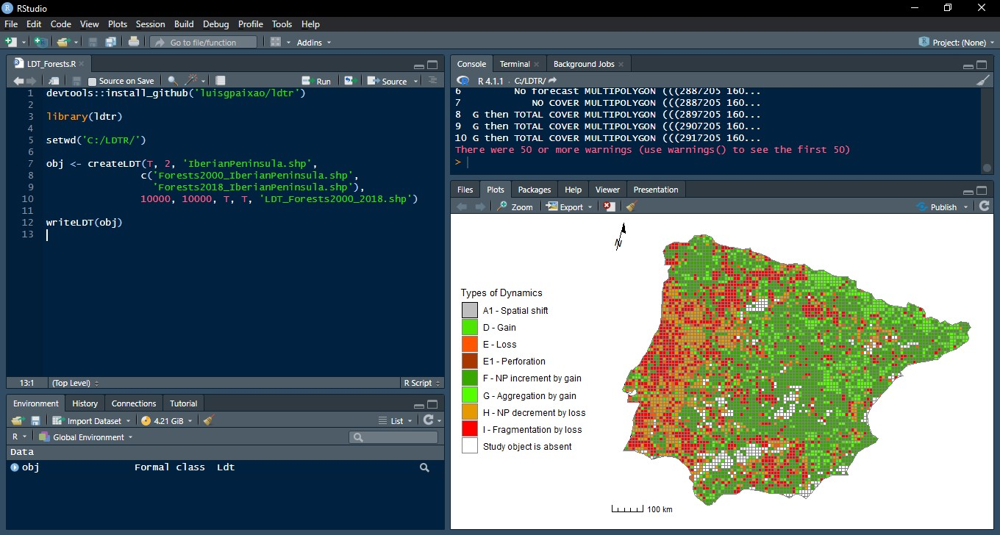
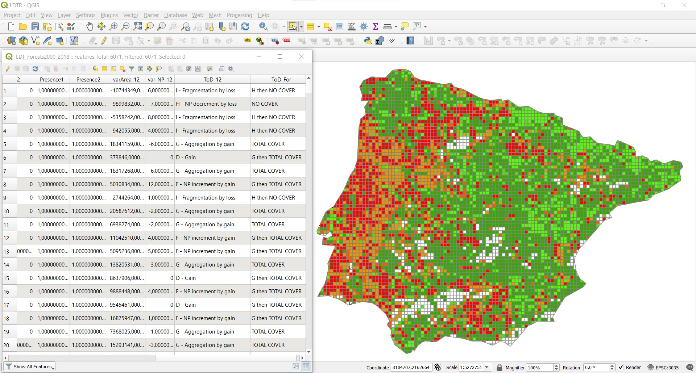

---
title: 'LDTR – An R package for landscape dynamics assessment'

tags:
  - R
  - landscape
  - dynamics
authors:
  - name: Luís Paixão
    orcid: 0000-0002-3070-9577
    affiliation: 1
  - name: Rui Machado
    orcid: 0000-0002-4345-6636
    affiliation: 2
affiliations:
 - name: Agroinsider Lda., PITE, R. Circular Norte, NERE, Sala 18, 7005-841 Évora, Portugal
   index: 1
 - name: MED – Mediterranean Institute for Agriculture, Environment and Development & CHANGE –Global Change and Sustainability Institute, Institute for Advanced Studies and Research, Universidade de Évora, Pólo da Mitra, Évora 7006-554, Portugal
   index: 2
date: 10 April 2025
bibliography: paper.bib

# Summary

LDTR is a R package that provides relevant functions for landscape dynamics analysis, using land cover ESRI shapefiles (*.shp), a widely used vector data format, which stores the location, shape and attributes of geographic features. LDTR differs from most software dedicated to landscape metrics calculation by using combination of metrics to identify land transformation processes. LDTR is based on the Landscape Dynamics Typology method, which has been implemented in several studies via other tools for ArcGIS and QGIS, and becomes now available in R, the sophisticated and versatile open-source computing environment, frequently used for geostatistical analysis.

Its user-friendliness is a strength, together with the straightforward and simple to interpret outputs, that can represent a final product or feed further analytical processes, depending on the study context. The applications are manifold including natural resources management, regional planning, urban expansion, biodiversity conservation, ecosystems services assessment, or other topics in which land cover changes and patterns are relevant.

# Statement of need

Landscapes result from the dynamic interplay of natural variables and anthropic activities. Due to their ecosystemic dimension, landscapes are often regarded as proper planning and management units, and are vastly studied for conservation purposes. Landscape patterns influence ecological processes [@turner1989; @uuemaa2013] and therefore it is essential to describe and quantify landscape characteristics in order to understand ecosystem services’ sustainability, and for the overall landscape environmental assessment [@lausch2015].

Landscape Dynamics Typology (LDT) [@machado2018] is an expedite method that uses combinations of landscape metrics to define types of dynamics (ToD), which are then used to classify analytical units (\autoref{fig:ldt_types}). LDT adds value to assessments related to LULC changes in topics, such as ecosystem services, biodiversity conservation, ecological restoration, invasive species control, etc. (see the “applications” section).

Up until this moment, there were two tools to automate the procedure: LDTtool [@machado2020], an ArcGIS [@esri2016] toolbox, and LDT4QGIS [@paixao2023], a solution for QGIS [@qgis2022] users. This paper introduces the new LDTR, a package to implement LDT in R [@r2022], which represents exposure to a wider audience of users not only able to increase the number of use-cases but also to adapt the source-code to fit their needs, develop functions and improve the overall performance of the package.



# Example

To demonstrate how LDTR works and the outputs it produces, we provide an example concerning Forest changes between the years 2000 and 2018, in the Iberian Peninsula. First, we installed the devtools package [@wickham2022] in RStudio (compulsory if not already installed), and used it to install LDTR directly from GitHub ([ldtr](https://github.com/luisgpaixao/ldtr)). Next, we set the folder containing the input files as working directory.

The base data were extracted from CORINE Land Cover (CLC) maps for 2000 and 2018. First, the CLC maps were clipped using the Iberian Peninsula boundaries, and then the land cover category “3.1 Forests” (includes “3.1.1 Broad-leaved forest”, “3.1.2 Coniferous forest” and “3.1.3 Mixed forest”) was extracted and used as study object.

Concerning the LDTR, it requires basic configuration such as the paths to the input files and name and path for the output file. The analysis was set for two moments as we were using comparisons between two dates, using 10km x 10km squares as analytical units and using only polygons of 1 ha or larger. Additional features were selected as well: “Perforation” which adds this ToD to the pool of possible outputs, and “Forecast” which adds an extra field with the ToDs that could be expected in a scenario where the dynamics remains (\autoref{fig:fig2}). Other options are to use more than two analytical moments, change the squares size or even use districts instead of squares, change the minimum polygon size, and switch on or off the perforation and the forecast calculation. The associated package documentation contains all the support information.

The basic code to define variables and settings is as follows:
```
devtools::install_github(Git path)
library(ldtr)
setwd(working dir path)

obj <- createLDT (analysis_squares, nmoments,
				  studyareapath, momentspaths,
				  patches, squares, perforation,
				  forecast, output)
writeLDT(obj)
```



LDTR produces a useful plot for quick preview and validation inside the R environment (\autoref{fig:fig3}) as well as the corresponding *.PNG file, but the main output is the newly created shapefile, in this case the “LDT_Forests2000_2018.shp” which contains the populated attribute table, easily usable in GIS software for both further tabular calculations and map production (\autoref{fig:fig4}).





# Applications

LDT has been used in multiple analytic contexts related to urban planning and mostly natural resources management. LDTR predecessors have contributed to assess built-up area expansion in Romania [@stoica2021], urban form dynamics [@jatayu2022] and urban transitions [@pribadi2023] in Indonesia, to study afforestation in Spain [@navarro2022], alien plants in Portugal [@machado2021], grasslands in Slovenia [@machado2024], forest fragmentation and connectivity in South American dry forests [@rivas2024] and more recently urban expansion in Ethiopia [@yasin2025].

# References
